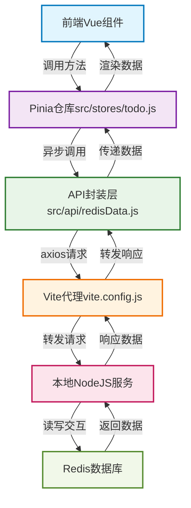
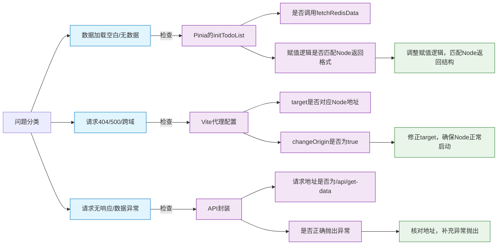

Todo项目核心链路（前端→Node→Redis）MD极简版

本文档为极简核心链路版，聚焦前端与后端、Redis的数据交互全流程，标注核心文件及问题排查点，适配接手者快速上手。

先运行 npm run dev 启动项目，浏览器访问 http://localhost:5173/ 即可查看结果。
然后运行 node api/server.js 启动Node服务，浏览器访问 http://localhost:3000/api/get-data 即可查看Redis数据。

# 一、核心数据流向图



关键：仅初始化加载为前后端交互，其余操作均为前端内存操作。

# 二、核心文件清单（按优先级排序）

| 优先级 | 文件路径 | 核心职责 | 关键作用 |
|--------|----------|----------|----------|
| ★★★★★ | src/stores/todo.js | Pinia状态仓库 | 管理数据状态，调用API加载后端数据 |
| ★★★★★ | src/api/redisData.js | 前端请求封装 | 唯一后端请求出口，封装axios逻辑 |
| ★★★★☆ | vite.config.js | Vite代理配置 | 解决跨域，转发请求至Node服务 |
| ★★★☆☆ | TodoList.vue等组件 | 页面渲染交互 | 调用Pinia方法，仅负责视图展示 |
| ★★☆☆☆ | 本地NodeJS服务 | 后端中间层 | 与Redis交互，前端无需修改 |

# 三、核心文件精简代码

## 3.1 src/stores/todo.js（核心）

```javascript
import { defineStore } from 'pinia'
import { fetchRedisData } from '../api/redisData'

export const useTodoStore = defineStore('todo', {
  state: () => ({ todoList: [], filterType: 'all' }),
  getters: {
    filterTodoList() {
      switch (this.filterType) {
        case 'done': return this.todoList.filter(item => item.isDone)
        case 'undone': return this.todoList.filter(item => !item.isDone)
        default: return this.todoList
      }
    }
  },
  actions: {
    // 唯一加载Redis数据的方法
    async initTodoList() {
      const data = await fetchRedisData()
      this.todoList = data.redis_get_result || data.data?.value || []
    },
    // 纯前端操作
    addTodo(content) {
      content.trim() && this.todoList.unshift({ id: Date.now(), content: content.trim(), isDone: false })
    },
    toggleTodoDone(id) {
      const todo = this.todoList.find(item => item.id === id)
      todo && (todo.isDone = !todo.isDone)
    },
    deleteTodo(id) { this.todoList = this.todoList.filter(item => item.id !== id) },
    changeFilter(type) { this.filterType = type },
    clearAllTodo() { this.todoList = [] }
  }
})
```

## 3.2 src/api/redisData.js

```javascript
import axios from 'axios';

// 唯一请求Redis数据的方法
export const fetchRedisData = async () => {
  const response = await axios.get('/api/get-data');
  return response.data;
};
```

## 3.3 vite.config.js（核心代理）

```javascript
import { defineConfig } from 'vite'
import vue from '@vitejs/plugin-vue'

export default defineConfig({
  plugins: [vue()],
  server: {
    proxy: {
      '/api': {
        target: 'http://localhost:3000', // 对应Node服务地址
        changeOrigin: true // 必开跨域
      }
    }
  }
})
```

# 四、核心问题排查指南



# 五、接手快速上手3步流程

1. 理清数据流向：对照上述流向图，明确数据从Redis到前端的完整路径。

2. 定位核心文件：聚焦3个核心文件（Pinia仓库、API封装、代理配置）。

3. 聚焦核心操作：
        

  - 加载Redis数据：关注initTodoList与fetchRedisData方法。

  - 调整请求链路：修改API地址与Vite代理配置。

  - 修改业务逻辑：仅操作Pinia的actions方法，无需改动后端。

# 六、补充说明

- 前端Todo数据唯一后端来源：initTodoList调用fetchRedisData加载。

- 仅初始化加载同步Redis，其余操作均为前端内存操作。

- Node服务为中间层，前端只需确保其启动且地址与代理一致。
